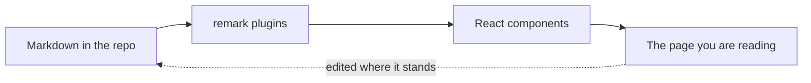
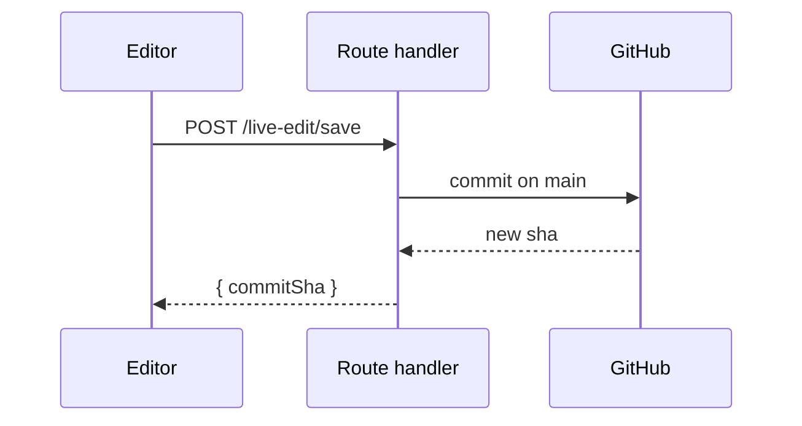

```mermaid
flowchart LR
  A[Markdown in the repo] --> B[remark plugins]
  B --> C[React components]
  C --> D[The page you are reading]
  D -. edited where it stands .-> A
```

```mermaid
sequenceDiagram
  participant E as Editor
  participant R as Route handler
  participant G as GitHub
  E->>R: POST /live-edit/save
  R->>G: commit on main
  G-->>R: new sha
  R-->>E: { commitSha }
```
